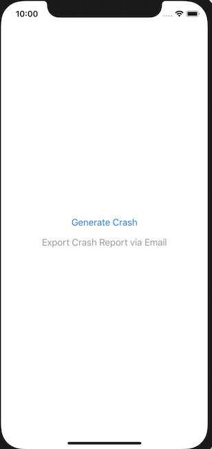

# PLCrashReporterUsage

iOS application using reliable, open-source crash reporter for iOS [PLCrashReporter](https://github.com/microsoft/plcrashreporter)

## Installation

Repository already includes PLCrashReporter but executed steps were as following:

PLCrashReporter is used via CocoaPods, see `Podfile`

```Pod
# Uncomment the next line to define a global platform for your project
# platform :ios, '9.0'

target 'plcrashreporterusage' do
  # Comment the next line if you don't want to use dynamic frameworks
  use_frameworks!

  # Pods for plcrashreporterusage
  pod 'PLCrashReporter'

end
```

Objective-C headers for PLCrashReporter are included in bridging header file `plcrashreporterusage-Bridging-Header.h`

```Objective-C
//
//  Use this file to import your target's public headers that you would like to expose to Swift.
//
#import <CrashReporter/CrashReporter.h>
```

# Usage

Crash reporting initialization is done in `AppDelegate` as explained in https://blog.kulman.sk/logging-ios-app-crashes/

```Swift
extension AppDelegate {
    func setupCrashReporting() {
        guard let crashReporter = PLCrashReporter.shared() else {
            return
        }

        if crashReporter.hasPendingCrashReport() {
            handleCrashReport(crashReporter)
        }

        if !crashReporter.enable() {
            print("Could not enable crash reporter")
        }
    }

    func handleCrashReport(_ crashReporter: PLCrashReporter) {
        guard let crashData = try? crashReporter.loadPendingCrashReportDataAndReturnError(), let report = try? PLCrashReport(data: crashData), !report.isKind(of: NSNull.classForCoder()) else {
            crashReporter.purgePendingCrashReport()
            return
        }

        let crash: NSString = PLCrashReportTextFormatter.stringValue(for: report, with: PLCrashReportTextFormatiOS)! as NSString
        // process the crash report, send it to a server, log it, etc
        print("CRASH REPORT:\n \(crash)")
        crashReporter.purgePendingCrashReport()
    }
}
```

You can generate a crash and, when running on a physical device, export the details via email in a converted iOS-compatible crash log text format.



# Example Data

Crash reports are output as protobuf-encoded messages. When testing on iOS simulator you can access the recorded crash reports via the following path:

/Users/`Username`/Library/Developer/CoreSimulator/Devices/`DeviceUUID`/data/Containers/Data/Application/`ApplicationUUID`/Library/Caches/com.plausiblelabs.crashreporter.data/`bundleIdentifier`

Such a report is bundled with this repository [here](.exampleData/live_report.plcrash)

The converted iOS-compatible crash log text format (Compatible with the crash logs generated by the device and available through iTunes Connect) is bundled with this repository [here](.exampleData/testCrashByPLCrashReportTextFormatter_PLCrashReportTextFormatiOS.txt)

This file was generated by the built-in re-usable formatter `PLCrashReportTextFormatter`

# Symbolication

See [here](./symbolication)
