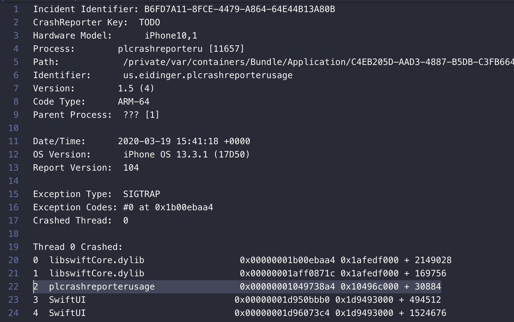

# Symbolicating Crash Reports

## Overview

Symbolication is the process of resolving backtrace addresses to source code method or function names, known as symbols.

As the compiler translates your source code into machine code, it also generates debug symbols which map each machine instruction in the compiled binary back to the line of source code from which it originated. Depending on build setting, these debug symbols are stored inside the binary or in a companion Debug Symbol (dSYM) file.

There are different ways to symbolicate a crash report.

It is strongly recommended to read [this article](https://developer.apple.com/library/archive/technotes/tn2151/_index.html)

The following is just a summary based on example / data stored in this repository

## Symbolicating Crash Reports with Atos

The [atos](https://www.unix.com/man-page/osx/1/atos/) command, available on OSX (Mac), converts numeric addresses to their symbolic equivalents

To symbolicate a part of a crash report using atos:

1. Find a line in the backtrace which you want to symbolicate. Note the name of the binary image in the second column, and the address in the third column.
2. Look for a binary image with that name in the list of binary images at the bottom of the crash report. Note the architecture and load address of the binary image.
3. Locate the dSYM file for the binary. You must provide the path to this file, not to the dSYM bundle, when invoking atos.
4. With the above information you can symbolicate addresses in the backtrace using the atos command. You can specify multiple addresses to symbolicate, separated by a space.

Scheme   
```
atos -arch <Binary Architecture> -o <Path to dSYM file>/Contents/Resources/DWARF/<binary image name> -l <load address> <address to symbolicate>
```

So to symbolicate information on line 22 of file `unsymCrashExportedFromApp.crash`



the following atos command

```
atos -arch arm64 -o ./9d6b5e00-7246-317c-89bb-5f941e71b227.dSYM/Contents/Resources/DWARF/plcrashreporterusage -l 0x10496c000 0x00000001049738a4
```

will provide the necessary result

```
closure #1 in closure #1 in ContentView.body.getter (in plcrashreporterusage) (ContentView.swift:0)
```

----

The UUID of a dSYM can be easily retrieved using the dwarfdump command:

```
dwarfdump -u 9d6b5e00-7246-317c-89bb-5f941e71b227.dSYM
```

Output

```
UUID: 2812A6DA-379F-3AE8-AF85-36B663F1E515 (arm64) plcrashreporterusage.app.dSYM/Contents/Resources/DWARF/plcrashreporterusage
```

## Symbolicating Crash Reports with symbolicatecrash

So far, we’ve looked at tools that symbolicate specific addresses within a crash, or at best a series of addresses in the case of ATOS. To make this process easier, Apple ships a Perl script `symbolicatecrash` with XCode that expedites the symbolication process of a crash report in its entirety. If you have a dSYM, your app binary and a crash report, this is probably the easiest method of symbolication. You don’t have to worry about any of the addresses – this script will parse the whole crash dump file and use ATOS to resolve all of the addresses into symbols for you.

See [here](https://www.apteligent.com/technical-resource/symbolicating-an-ios-crash-report/) for more details

## Other techniques

- Symbolicating with **lldb**: lldb is the default debugger in XCode on OSX and can be used to symbolicate lines from a crash. lldb is again included with XCode for OSX, and there are ports for Linux, FreeBSD and Windows available.
- Symbolicating with **Dwarfdump**: version of Dwarfdump is shipped with the XCode developer tools, but you can also get it, along with libdwarf, from the libdwarf project page

For a good overview and details see [here](https://www.apteligent.com/technical-resource/symbolicating-an-ios-crash-report/)

## Note: symbolicating on Linux

Most of the tools are OSX specific so either 3rd party or custom ports are needed to be used.

There is an unmaintained port for atos available on own risk: https://github.com/facebookarchive/atosl

