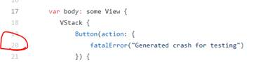
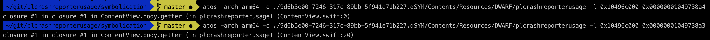
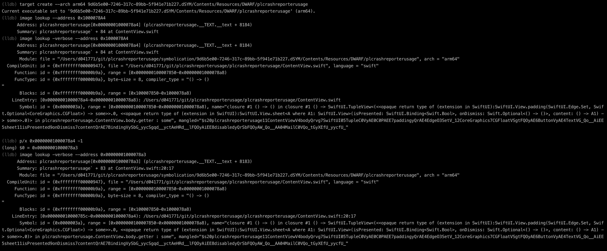

# Quirks

## Determine correct line number

In the [example](./../README.md) the cause of the crash was on line 20 in ContentView.swift file.

If symbolication tool did reveal no (or a zero) line number then the trick is to check the previous stack frame (i..e current hex address - 1)

Example `atos`

Example `lldb`

